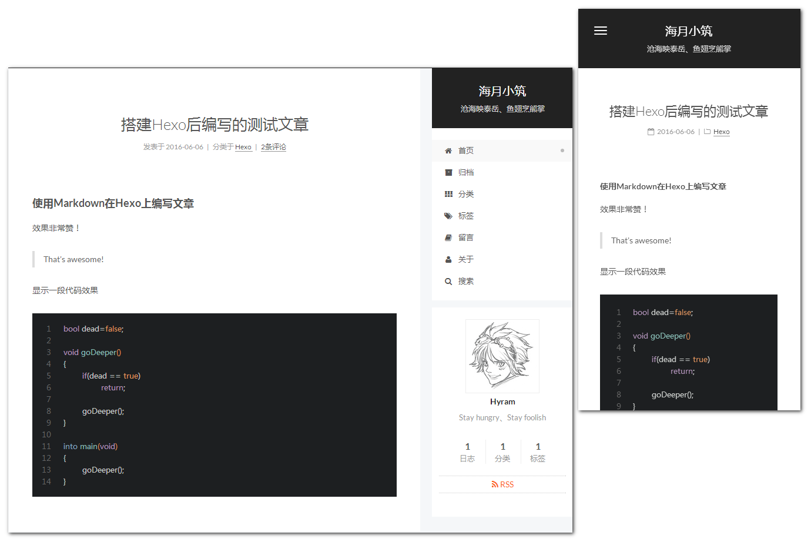

# 海月小筑
>个人技术博客

## 简介
对鄙人捣鼓的东西进行整理、记录、归纳、总结，并在此授人以渔；把个人对这个世界的认知进行分享；并把个人喜爱收藏的内容公诸同好。

#### 主要内容
- **域**.业务领域
- **术**.解决方案
- **技**.技术研究
- **阵**.技术应用
- **法**.手段方法
- **理**.理论学习
- **器**.工具使用
- **杂**.杂七杂八

## 博客框架
- 基于[**GitHub Pages**](https://pages.github.com/)网站空间
- 基于[**Hexo**](https://hexo.io/zh-cn/)博客框架
- 主题为[**NexT**](http://theme-next.iissnan.com/)，作者：[**iissnan**](https://github.com/iissnan/)

## 博客预览

